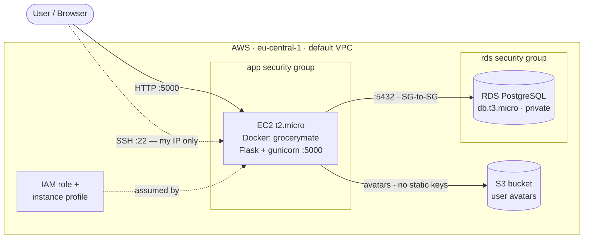

# GroceryMate on AWS — Terraform IaC

Deploys the **GroceryMate** e-commerce app to AWS as **Infrastructure as Code** (Terraform). The application itself is unchanged — this repo is the **cloud engineering**: containerization, AWS architecture, and reproducible provisioning.

> **Original application** (Flask + React, by Alejandro Roman Ibanez): <https://github.com/AlejandroRomanIbanez/AWS_grocery>

`Terraform` · `AWS (EC2 · RDS · S3 · IAM)` · `Docker` · `PostgreSQL` · `eu-central-1`

---

## Architecture



The EC2 instance boots via a Terraform `user_data` script that installs Docker, clones the app, builds the image, and runs the container — with DB credentials injected by Terraform and S3 access granted through the IAM role.

**Container:** `python:3.12-slim` base image with layer-cached dependencies, served by **gunicorn** (production WSGI server).

## AWS services

| Service | Role in the project | Why |
| --- | --- | --- |
| **EC2** (`t2.micro`) | Hosts the Dockerized app | Free-tier compute; runs the container directly |
| **RDS PostgreSQL** (`db.t3.micro`) | Managed database | Managed backups/patching; not self-hosted on the instance |
| **S3** | Stores user-uploaded avatars | Durable, scalable object storage; offloads files off EC2 |
| **IAM** (role + instance profile) | Grants EC2 scoped S3 access | No static credentials; least privilege |
| **Security Groups** | Network firewall | SSH locked to my IP; DB private (SG-to-SG); app public on 5000 |
| **EBS** (`gp3`, 30 GB) | EC2 root volume | Persistent disk for OS + Docker images |

## Infrastructure as Code

All Terraform lives in [`infrastructure/`](infrastructure/):

| File | Defines |
| --- | --- |
| `main.tf` | Provider, `default_tags`, input variables |
| `ec2.tf` | EC2 instance, AMI lookup, `user_data` bootstrap |
| `security_groups.tf` | App + RDS security groups |
| `rds.tf` | RDS PostgreSQL instance |
| `s3.tf` | S3 bucket (private, versioned) |
| `iam.tf` | IAM role, scoped S3 policy, instance profile |
| `outputs.tf` | EC2 public IP, RDS endpoint |

**Deploy / teardown steps** (including the one-time DB seed): see [`infrastructure/README.md`](infrastructure/README.md). In short:

```bash
cd infrastructure
terraform init && terraform apply     # provision
terraform destroy                     # tear down
```

## Security

- **SSH (22)** restricted to a single IP via the `my_ip` variable — not open to the internet.
- **RDS is private** (`publicly_accessible = false`); only the app security group can reach `5432` (SG-to-SG rule), so the database is never internet-facing.
- **S3 access via IAM instance profile** — no access keys anywhere; the policy is scoped to the one avatars bucket (least privilege). The bucket blocks all public access and has versioning enabled.
- **Secrets stay out of git** — `terraform.tfvars` and state are gitignored; the app's JWT secret is generated on the instance at boot.

## Cost optimization

- **Free-tier tiers** — `t2.micro` EC2 and `db.t3.micro` RDS; 30 GB `gp3` EBS within the free storage allowance.
- **No NAT Gateway** — the EC2 sits in a public subnet and reaches RDS privately via security groups, avoiding NAT's hourly charge.
- **Single-AZ RDS** — no Multi-AZ / read-replica costs for a project workload.
- **Direct public IP, no load balancer** — one instance served directly on `:5000`, avoiding ALB cost.
- **Pause & tear down** — stop EC2/RDS to halt compute charges; `terraform destroy` removes everything when not in use.
- **Note:** public IPv4 addresses now carry a small hourly charge, so a stopped-but-not-destroyed stack still incurs minor cost.
